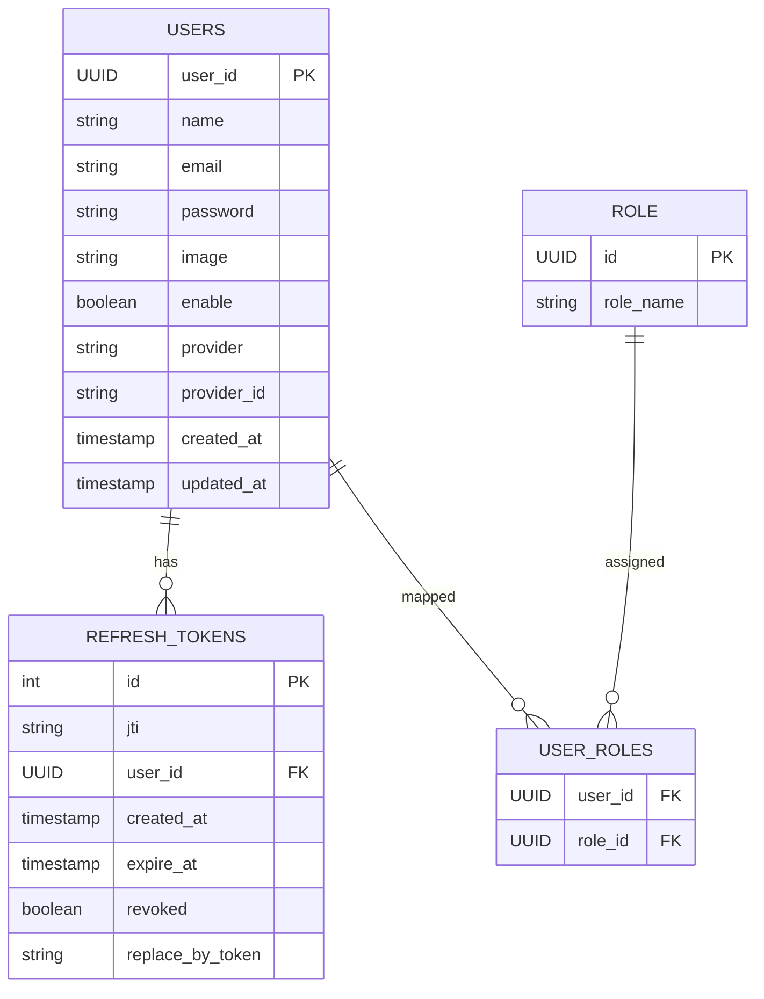

# 🔐 Production Ready Auth System

A production-level authentication and authorization system built using Java, Spring Boot, Spring Security, JWT, OAuth2, Refresh Tokens, Role-Based Authorization, and Swagger Documentation.

This project demonstrates how modern authentication systems work in real-world backend applications.

---

# 🚀 Features

* ✅ JWT Authentication
* ✅ Access Token & Refresh Token
* ✅ Refresh Token Rotation
* ✅ OAuth2 Login (Google & GitHub)
* ✅ Spring Security Integration
* ✅ Role-Based Authorization
* ✅ Secure HTTPOnly Cookies
* ✅ Swagger OpenAPI Documentation
* ✅ MySQL Database Integration
* ✅ User Registration & Login
* ✅ Production-Level Security Architecture
* ✅ Exception Handling
* ✅ DTO Layer
* ✅ Layered Architecture
* ✅ REST APIs

---

# 🛠️ Tech Stack

| Technology      | Version         |
| --------------- | --------------- |
| Java            | 21              |
| Spring Boot     | 3.5.6           |
| Spring Security | 6               |
| JWT             | 0.12.6          |
| MySQL           | 8+              |
| Maven           | Latest          |
| Swagger OpenAPI | 2.8.9           |
| Lombok          | Latest          |
| OAuth2          | Google & GitHub |

---

# 📁 Project Structure

```text
src/main/java/com/example/authsystem
│
├── config
├── controller
├── dto
├── entity
├── repositories
├── security
├── services
├── ServiceImplementation
└── exception
```

---

# 🧠 Authentication Flow

## 🔑 JWT Login Flow

1. User sends email & password
2. Spring Security authenticates user
3. Access Token generated
4. Refresh Token stored in database
5. Refresh Token sent via HTTPOnly cookie
6. Access Token used for secured APIs
7. Refresh Token generates new access token

---

# 🌐 OAuth2 Login Flow

Supported Providers:

* Google
* GitHub

OAuth2 flow:

1. User clicks Google/GitHub login
2. OAuth provider authenticates user
3. User details fetched
4. User stored in database
5. JWT Tokens generated
6. Refresh Token saved
7. Secure login completed

---

# 🗄️ ER Diagram



---

# 🔒 Security Features

## JWT Security

* Access Token Expiration
* Refresh Token Expiration
* Token Rotation
* Revoked Token Handling
* HTTPOnly Cookies
* Secure Authentication

---

# 🔐 Roles & Authorization

The application supports role-based authorization.

Example Roles:

* ROLE_USER
* ROLE_ADMIN

Authorization is handled using Spring Security.

---

# 📡 API Endpoints

## Authentication APIs

| Method | Endpoint         | Description          |
| ------ | ---------------- | -------------------- |
| POST   | `/auth/register` | Register User        |
| POST   | `/auth/login`    | Login User           |
| POST   | `/auth/refresh`  | Refresh Access Token |
| POST   | `/auth/logout`   | Logout User          |

---

## OAuth2 APIs

| Method | Endpoint                       |
| ------ | ------------------------------ |
| GET    | `/oauth2/authorization/google` |
| GET    | `/oauth2/authorization/github` |

---

## User APIs

| Method | Endpoint      | Access |
| ------ | ------------- | ------ |
| GET    | `/users`      | ADMIN  |
| GET    | `/users/{id}` | ADMIN  |
| DELETE | `/users/{id}` | ADMIN  |

---

# 📖 Swagger Documentation

After running the application:

```text
http://localhost:8090/swagger-ui/index.html
```

API Docs:

```text
http://localhost:8090/v3/api-docs
```

---

# ⚙️ Environment Variables

Never store secrets directly in source code.

Use environment variables:

```yaml
GOOGLE_CLIENT_ID
GOOGLE_CLIENT_SECRET
GITHUB_CLIENT_ID
GITHUB_CLIENT_SECRET
JWT_SECRET
```

---

# 🧾 application.yaml Example

```yaml
spring:
  datasource:
    url: jdbc:mysql://localhost:3306/auth_system
    username: root
    password: password

  jpa:
    hibernate:
      ddl-auto: update

  security:
    oauth2:
      client:
        registration:
          google:
            client-id: ${GOOGLE_CLIENT_ID}
            client-secret: ${GOOGLE_CLIENT_SECRET}

          github:
            client-id: ${GITHUB_CLIENT_ID}
            client-secret: ${GITHUB_CLIENT_SECRET}
```

---

# ▶️ Run Project

## Clone Repository

```bash
git clone https://github.com/yash938/Production-Ready-Auth-System.git
```

---

## Navigate to Project

```bash
cd Production-Ready-Auth-System
```

---

## Run Application

```bash
mvn spring-boot:run
```

---

# 🧪 Testing APIs

You can test APIs using:

* Postman
* Swagger UI
* Thunder Client

---

# 📌 Key Concepts Implemented

* Spring Security
* JWT Authentication
* OAuth2 Authentication
* Secure Cookie Handling
* Refresh Token Mechanism
* Role-Based Access Control
* DTO Pattern
* Layered Architecture
* RESTful APIs
* Secure Backend Design

---

# 🏗️ Architecture

The project follows layered architecture:

```text
Controller Layer
        ↓
Service Layer
        ↓
Repository Layer
        ↓
Database
```

---

# 📷 Screenshots

Add your screenshots here:

* Swagger UI
* Login APIs
* OAuth Login
* Database Tables
* Postman Responses

---

# 👨‍💻 Author

## Yash Sharma

Java Spring Boot Developer

* Backend Development
* Spring Security
* JWT Authentication
* OAuth2
* REST APIs
* Production-Level Backend Systems

GitHub:

```text
https://github.com/yash938
```

---

# ⭐ Future Improvements

* Redis Token Blacklisting
* Email Verification
* Password Reset
* Docker Deployment
* Kubernetes Deployment
* Rate Limiting
* API Gateway
* Microservices Architecture

---

# 📜 License

This project is licensed under the MIT License.

---

# 🌟 Support

If you like this project:

* ⭐ Star the repository
* 🍴 Fork the project
* 🧑‍💻 Contribute to the project

---

# 🙌 Thank You

Thank you for visiting this project.
